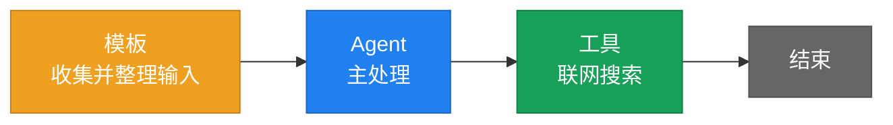
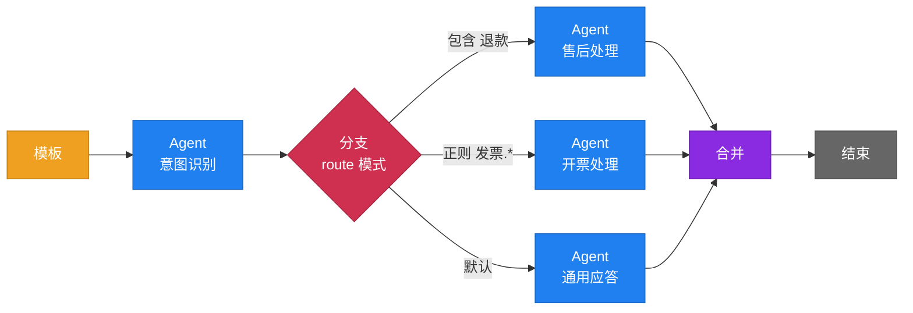
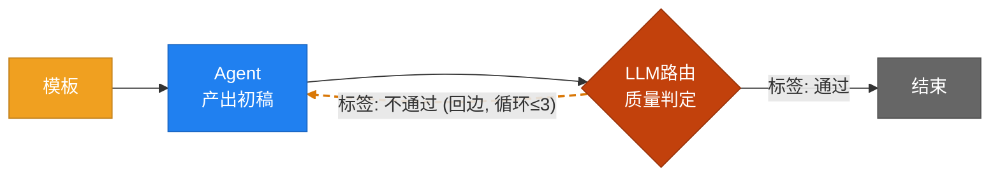
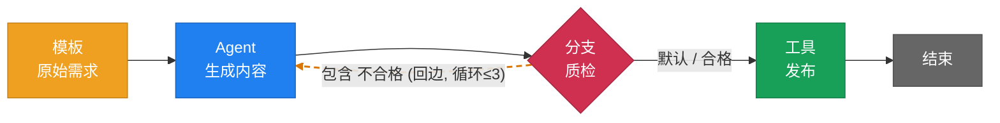
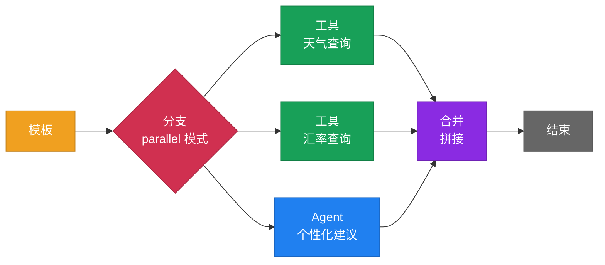
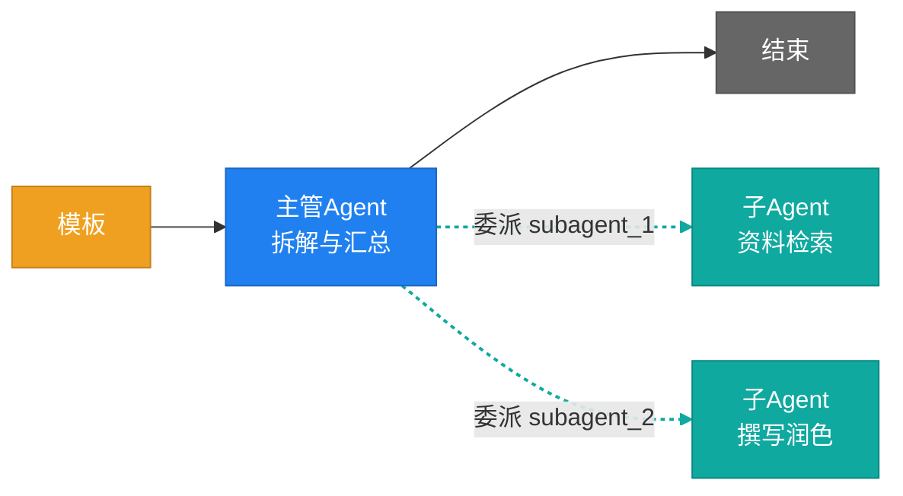
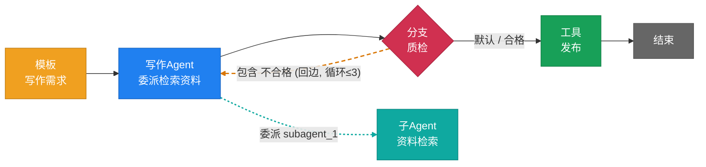

# Agent Studio 编排图例

> 本文用 Mermaid 画出当前编排引擎支持的各种形态（GitHub / Gitee / VSCode 均可直接渲染）。
> 节点配色与画布 `nodes/registry.ts` 一致；橙色虚线 = 循环回边，青色虚线 = 子 Agent 委派边（画布中委派边实为普通实线，仅此处做区分）。

## 一、节点类型一览

| 类型 | 画布名 | 入边 | 出边 | 说明 |
|---|---|---|---|---|
| `template` | 模板 | ≤1 | ≤1 | 消息变换器；入口节点务必引用 `{{.Input}}`，否则用户输入会在此被丢弃 |
| `agent` | Agent | ≤1 | ≤1 (+委派) | 主力节点，ReAct 循环；可同时委派多个子 Agent |
| `tool` | 工具 | ≤1 | ≤1 | 调用单个工具，输出向下传递 |
| `branch` | 分支 | 多 | 多 | 条件路由（contains/equals/regex）或并行分发；条件目标须覆盖所有连线 |
| `router` | LLM路由 | 恰好1 | 多 | 模型把上游内容归入唯一标签并按标签路由；分类目标须与连线一致 |
| `extract` | 字段提取 | ≤1 | ≤1 | 上游内容为 JSON 时按字段路径抽取，失败走 fallback |
| `merge` | 合并 | 多 | ≤1 | 多路汇聚，按分隔符拼接 |
| `end` | 结束 | ≤1 | 0 | 出口标记（出口也可以是任意无出边节点） |
| `subagent` | 子Agent | 恰好1条委派边 | 0 | 被主 Agent 委派执行，结果作为工具结果返回主 Agent |
| `suborch` | 子编排 | ≤1 | ≤1 | 引用已保存的编排作为节点，编译时展开 |

**全局硬约束**：恰好 1 个入口（无入边）＋ 恰好 1 个出口（无出边）；正向边不允许成环；分支与 LLM路由不可混用；LLM路由与合并不可混用；循环回边与合并不可混用。

---

## 二、各种编排形态

### 1. 线性流水线（Chain）

最简单的形态，逐节点顺序执行。适合"预处理 → 处理 → 后处理"的单一路径任务。

> 入口模板记得写 `{{.Input}}`（不引用会触发画布警告，且对话模式下用户输入会被丢弃）。

### 2. 条件分支（Branch · route 互斥路由）

按条件把内容路由到唯一分支。**多路径必须经合并节点汇聚**（否则出口不唯一），未选中的路径由运行时整体跳过。

> 校验点：分支的**每条画布连线目标都必须出现在分类条件中**；条件支持 包含 / 等于 / 正则；`default_target` 无条件命中兜底。

### 3. LLM 路由循环门控（Router + 循环回边）

由模型判定"通过 / 不通过"，不通过则循环回上游重做，超过循环上限强制走退出目标。**这是当前版本 LLM 路由的主打形态**——多目标互斥分流需要合并节点汇聚，而"路由 + 合并"暂不支持，需要分流请用分支节点。

> 校验点：回边目标必须在分类条件中；`max_loops ≥ 1` 必填；每个路由节点只能有一条回边；路由节点的分类调用同样计入 Token 用量。

### 4. 分支循环重试（Branch + 循环回边）

质检不通过打回重做，上限之内自愈、超限强制退出。与上一图同构，判定由**规则匹配**（而非模型）完成，可与 LLM路由二选一（两者不可混用）。

> 画布操作：正向路径画完后，从分支连一条线回上游目标（自动识别为橙色虚线回边；画早了可右键该连线「转为循环回边」），再到配置面板把回边目标加入分类条件并设循环上限。

### 5. 并行分发 + 合并（Branch parallel + Merge）

一个任务同时分发给多条路径执行，结果在合并节点拼接。**每条分发路径都必须汇入合并节点**（这是并行模式的硬校验），且并行分支不支持循环回边。

### 6. 字段提取（Extract）

上游输出 JSON 时按字段路径抽取值，抽不到走 fallback（为空则原样透传），保证流水线不被脏输出打断。

### 7. 子 Agent 委派（主管模式）

主管 Agent 把任务拆给多个子 Agent（每个子 Agent 编译为独立 react.Agent 并包装成 `subagent_1..N` 委派工具），主 Agent 的 ReAct 循环按需调用；委派说明会自动注入主 Agent 系统提示词。

> 画布操作：从主 Agent 连到子 Agent 即委派边；子 Agent 没有出线桩，不能再向外连线。子 Agent 可引用已有 Agent（agent_type=subagent），也可内联系统提示词；**两者都为空时校验不过**，且主 Agent 大概率不会主动调用它。

### 8. 子编排（Sub-orchestration，嵌套复用）

把已保存的编排整体作为一个节点复用，编译时展开（内部节点 id 自动加前缀），适合"日报生成 / 行情同步"这类可独立维护的子流程。

> 约束：禁止循环引用与超深嵌套；嵌套编排不注入对话历史与身份前言，入口同样要引用 `{{.Input}}`。

### 9. 综合示例（内容生产流水线）

模板收需求 → 写作 Agent（委派检索子 Agent）→ 质检分支循环（不合格打回、上限 3 次）→ 合格后经发布工具收尾。一次用上 模板 / Agent / 子Agent / 分支回边 / 工具 / 结束 六种节点。

---

## 三、画布校验规则速查

**结构**
- 恰好 1 个入口（无入边）、恰好 1 个出口（无出边）
- 非 merge 节点最多 1 条入边；非 branch/router 节点最多 1 条出边
- 正向连线不允许成环；自环不允许

**混用禁令（当前版本）**
- 分支 + LLM路由 ✗（要分流用分支，要门控循环用路由）
- LLM路由 + 合并 ✗（因此路由的多目标互斥分流暂不可用，主打循环门控形态）
- 循环回边 + 合并 ✗

**分支 / 路由**
- 画布连线目标必须全部出现在分类条件中；连线数（含回边）必须等于"分类目标 ∪ 默认目标"的数量
- route 模式多路径、并行模式所有路径，都必须经合并节点收尾
- 并行分支：≥2 个目标、不支持回边、每条路径必须汇入合并节点

**循环回边**
- 只能从分支 / LLM路由发出，每个节点限 1 条
- 回边目标不能是子 Agent；目标必须沿主流可达该节点（真正成环）
- 回边目标必须在分类条件中；`max_loops ≥ 1` 必填，超限强制走退出目标
- 与合并节点互斥

**子 Agent**
- 入边必须来自 Agent 节点（委派方向：主 Agent → 子Agent），子Agent 无出边
- 一个主 Agent 可委派多个；引用 Agent 与内联提示词至少留一个

**工具 / 调用**
- Agent / 子Agent 节点可配置模型调用重试次数（max_retries 0-10，0 用框架默认）
- 工具审批：配置了 confirm_required 的工具执行前会中断等待人工确认（对话与调试均支持）
